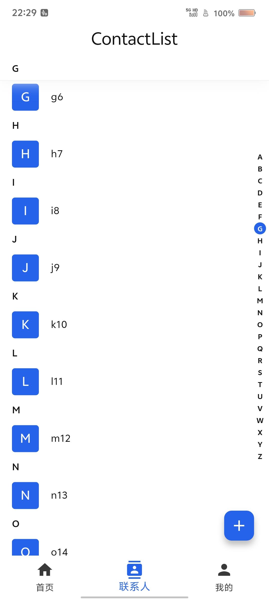
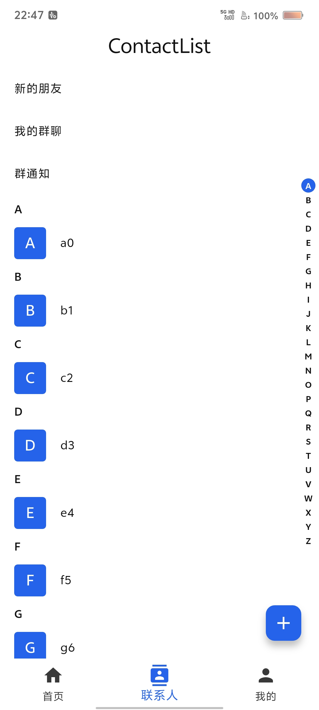

[English](README.md) | [中文](README_zh.md)

# ContactListView

[](https://central.sonatype.com/artifact/io.github.matkurban/contactlistview)
[](https://opensource.org/licenses/MIT)

A Compose Multiplatform library that ports the [contact_list_view](https://github.com/Matkurban/contact_list_view) Flutter package. It provides an A-Z grouped contact list with sticky section headers, a right-side alphabet index bar, and a floating cursor while dragging.

Repository: [github.com/Matkurban/ContactListView](https://github.com/Matkurban/ContactListView)

## Screenshots

|                         ScreenShot                         |                                                  ScreenShot                                                   |
|:----------------------------------------------------------:|:-------------------------------------------------------------------------------------------------------------:|
|  | [](doc/videos/Screenrecording_20260202_222939.mp4) |

## Features

- **A-Z grouping** — groups contacts by tag with `#` sorted last
- **Sticky section headers** — optional pinned overlay header while scrolling
- **Alphabet index bar** — tap or drag to jump between sections
- **Floating cursor** — letter indicator shown while dragging the index bar
- **Custom builders** — `stickyHeaderBuilder`, `cursorBuilder`, index bar style builders
- **`startContent` / `endContent`** — leading and trailing lazy list slots
- **100% commonMain** — single shared source set for all platforms

## Supported Platforms

| Platform | Target                 |
|----------|------------------------|
| Android  | minSdk 24              |
| iOS      | Arm64, Simulator Arm64 |
| Desktop  | JVM                    |
| Web      | JS, Wasm               |

## Installation

### Version Catalog (`gradle/libs.versions.toml`)

Add to your `gradle/libs.versions.toml`:

```toml
[versions]
contactlistview = "1.0.0"

[libraries]
contactlistview = { module = "io.github.matkurban:contactlistview", version.ref = "contactlistview" }
```

Then in `build.gradle.kts`:

```kotlin
kotlin {
    sourceSets {
        commonMain.dependencies {
            implementation(libs.contactlistview)
        }
    }
}
```

### Direct dependency

Alternatively, add the dependency directly to your `commonMain` source set:

```kotlin
// build.gradle.kts
kotlin {
    sourceSets {
        commonMain.dependencies {
            implementation("io.github.matkurban:contactlistview:1.0.0")
        }
    }
}
```

Import from `io.github.matkurban.contactlistview.*`.

## Quick Start

```kotlin
import androidx.compose.material3.ListItem
import androidx.compose.material3.Text
import io.github.matkurban.contactlistview.ContactListView

data class Contact(val name: String)

ContactListView(
    contactsList = contacts,
    tag = { contact ->
        val first = contact.name.firstOrNull()?.uppercaseChar() ?: '#'
        if (first in 'A'..'Z') first.toString() else "#"
    },
    sticky = true,
    startContent = {
        item { ListItem(headlineContent = { Text("New friends") }) }
    },
    endContent = {
        item { ListItem(headlineContent = { Text("Total ${contacts.size} contacts") }) }
    },
    itemBuilder = { contact ->
        ListItem(headlineContent = { Text(contact.name) })
    },
)
```

## Customization

| API                                | Description                                          |
|------------------------------------|------------------------------------------------------|
| `stickyHeaderBuilder`              | Custom section header; receives `tag` and `isPinned` |
| `cursorBuilder`                    | Custom floating cursor while dragging the index bar  |
| `indexBarBoxDecorationBuilder`     | Style index bar item background per selection state  |
| `indexBarTextStyleBuilder`         | Style index bar item text per selection state        |
| `stickyHeaderBoxDecorationBuilder` | Style sticky header background per pinned state      |
| `stickyHeaderTextStyleBuilder`     | Style sticky header text per pinned state            |
| `startContent` / `endContent`      | Extra lazy list items before/after grouped contacts  |

## Sample Apps

This repository includes demo apps for each platform:

| Module       | Description                                   |
|--------------|-----------------------------------------------|
| `sample`     | Shared demo UI (`App`, `ContactScreen`, etc.) |
| `androidApp` | Android sample shell                          |
| `desktopApp` | JVM desktop app via Compose Desktop           |
| `webApp`     | Browser app (Wasm)                            |

Run the samples:

```bash
./gradlew :androidApp:assembleDebug
./gradlew :desktopApp:run
./gradlew :webApp:wasmJsBrowserDevelopmentRun
./gradlew :contactlistview:jvmTest
```

## Requirements

- Kotlin 2.4.0+
- Compose Multiplatform 1.11.1+
- JDK 17+

## Project Structure

- `contactlistview` — published library (100% `commonMain`)
- `sample` — demo UI (not published)
- `androidApp` / `desktopApp` / `webApp` — sample apps

## Related

- [Original Flutter package](https://github.com/Matkurban/contact_list_view)
- [Maven publishing guide (BUILD.md)](BUILD.md)

## License

This project is licensed under the [MIT License](https://opensource.org/licenses/MIT).
